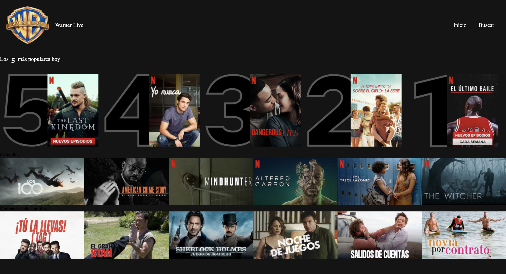
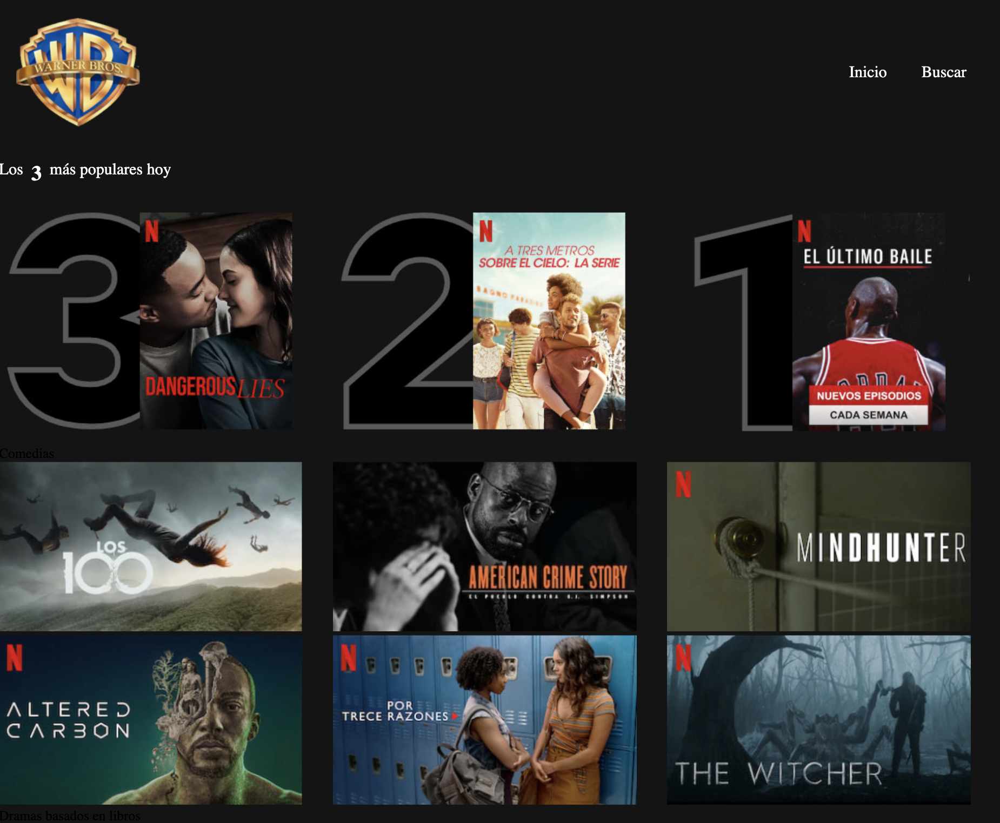

# Lemoncode-Master-module-Responsive Netflix

In this layout exercise is used:

- Parcel
- Sass
- HTML

To run the project type the following command: `parcel src/index.html`

The layout consists of replicating a Netflix-like screen that is responsive using Sass media queries. 

Web view:

Tablet view

